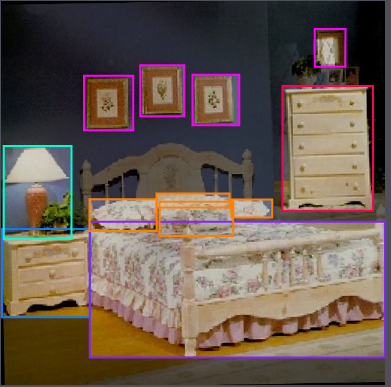

# Multi-Class Object Detection

This project focuses on training and evaluating **two different models** for **multi-class object detection** on bedroom images. The goal is to detect the following object classes:

**Bed, Pillow, Bedside Table, Picture, Lamp, Dresser, Door, Curtain, Chair, Window**

---

## Dataset

The dataset can be obtained from **RoboFlow**:  
https://app.roboflow.com/ci-xrxgt/object-detection-cf3ny/5

- **315 images** were manually annotated
- After data augmentation, the dataset was expanded to **815 images**
- Dataset split:
  - **Training:** 750 images  
  - **Validation:** 45 images  
  - **Testing:** 20 images  

---

## Models

### 1. YOLOv5

The first model is based on **YOLOv5s**, trained using **transfer learning** and **hyperparameter tuning**.

**Notebook:**
- `yolo/object_detection.ipynb`

---

### 2. Detection Transformer (DETR)

The second model uses the **Detection Transformer (DETR)** from **Hugging Face**, trained using **fine-tuning** and **hyperparameter optimization**.

#### Training

**Notebook:**
- `detr/model_training.ipynb`

**Parameters:**
- `TRAIN_IN_COLAB` – If `True`, paths are set to the mounted Google Drive in Colab
- `DRIVE_BASE_PATH` – Base path of the mounted Google Drive
- `CHECKPOINTS_PATH` – Path to save best and last model checkpoints
- `LOGS_PATH` – Path for TensorBoard logs
- `TRAIN_DATASET_PATH` – Path to the training dataset
- `VAL_DATASET_PATH` – Path to the validation dataset
- `BATCH_SIZE` – Training batch size
- `NUM_EPOCHS` – Number of training epochs

---

#### Evaluation

**Notebook:**
- `detr/model_evaluation.ipynb`

**Parameters:**
- `BEST_CHECKPOINT` – Path to the best model checkpoint
- `TEST_DATASET_PATH` – Path to the test dataset
- `CONFIDENCE_THRESHOLD` – Confidence threshold for predictions
- `IOU_THRESHOLD` – Intersection over Union (IoU) threshold for Non-Max Suppression
